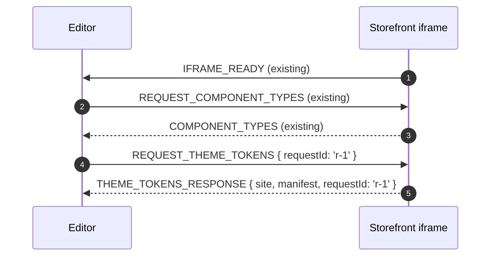

# LiveEditor Migration Guide — HTTP surface removal & theme-token postMessage

**Audience:** the CMS LiveEditor agent / team.
**Storefront cut-off:** all `medienwerft-cms-plugin` builds from this
release onward.
**TL;DR:** every HTTP endpoint the storefront used to expose for CMS
editing has been removed. Theme-token discovery moved to the existing
`postMessage` channel. Cache invalidation is replaced by a fixed
5-minute fetch TTL — there is no editor-triggered revalidation
anymore.

---

## 1. What changed, in one table

| Old surface | Status | Replacement |
|---|---|---|
| `GET /api/cms?slug=…&locale=…&site=…` | **Removed** | None — the storefront resolves pages internally during SSR. No editor caller existed; remove any leftover code. |
| `GET /api/ext/cms/page?slug=…` | **Removed** | Same as above. |
| `GET /api/cms/theme-tokens?site=…` | **Removed** | `REQUEST_THEME_TOKENS` ⇄ `THEME_TOKENS_RESPONSE` over the iframe `postMessage` channel. See §3. |
| `GET /api/ext/cms/theme-tokens?site=…` | **Removed** | Same as above. |
| `POST /api/cms/revalidate` | **Removed** | None. Live-theme reads run with `next: { revalidate: 300 }`; published changes propagate to shoppers within ~5 minutes automatically. See §4. |
| `POST /api/ext/cms/revalidate` | **Removed** | Same as above. |

Anything calling those URLs returns `404` from the storefront now.
Sentry / network panels will surface remaining callers immediately.

### 1.1 Behaviour change for existing theme messages

`UPDATE_THEME_VARIABLES` and `RESET_THEME_VARIABLES` previously had a
**required** `site` field, and the storefront silently ignored any
message whose `site` did not match the iframe's. That guard turned
out to be a footgun — a payload like

```json
{ "type": "UPDATE_THEME_VARIABLES", "variables": { "--x": "red" }, "mode": "merge" }
```

was dropped without trace.

Effective with this storefront release the field is **optional**:

- **Omitted** → "this iframe". This is the recommended default; the
  iframe is scoped to one site by construction (the one whose preview
  is open).
- **Present** → still validated against the iframe's site. Mismatches
  are still dropped, so multi-iframe editors can keep using `site`
  defensively.

No code change is required if you already send a correct `site`. If
you don't (and you saw "no effect" reports from the live preview),
either drop the field or set it to the value the storefront returned
in `THEME_RESPONSE.site` / `THEME_TOKENS_RESPONSE.site`.

---

## 2. Why

- Every editor operation that needs *live* storefront data already
  rides the iframe `postMessage` channel (component types, category
  tree, theme variables, navigation). Theme tokens were the last
  outlier.
- Folding theme tokens into the same protocol drops a whole class of
  cross-origin issues: no CORS preflight, no auth-key plumbing, no
  serverless cold-start latency on the manifest fetch.
- `unstable_cache` + `revalidateTag` does not behave reliably across
  warm / cold lambda boundaries. A fixed 5-minute fetch TTL is the
  serverless-safe equivalent and removes the editor's responsibility
  to fire a revalidate call after every save.

---

## 3. New postMessage exchange — `REQUEST_THEME_TOKENS`

### 3.1 Message contract

Add the two messages to your `CMSEditorMessage` union (mirror of
[`extensions/medienwerft-cms-plugin/types.d.ts`](../types.d.ts)):

```ts
export interface RequestThemeTokensMessage {
  type: 'REQUEST_THEME_TOKENS';
  /** Optional correlation id — echoed back in the response. */
  requestId?: string;
}

export interface ThemeTokensResponseMessage {
  type: 'THEME_TOKENS_RESPONSE';
  /** Site the manifest was resolved for (echoes the storefront's current site). */
  site: string;
  /** Token manifest — same shape `/api/ext/cms/theme-tokens` used to return. */
  manifest: ThemeTokenManifest;
  requestId?: string;
}
```

The `manifest` shape is **unchanged** from the old endpoint payload:

```jsonc
{
  "site": "main",
  "baseTheme": "theme-medienwerft",
  "fallback": false,
  "groups": [
    {
      "id": "colors",
      "label": "Colors",
      "tokens": [
        {
          "name": "--color-primary-500",
          "label": "Primary 500 (action)",
          "type": "color",
          "defaultValue": "#f99700"
        }
      ]
    }
  ]
}
```

`fallback: true` means the storefront has no
`CMSThemeTokenManifestService` bound (or the host shipped the empty
default). Treat it as "no site-specific list, render the generic UI".

### 3.2 When to fetch

Use the same lifecycle hook the LiveEditor already uses for
`REQUEST_COMPONENT_TYPES`: after the iframe replies with
`IFRAME_READY`. The storefront's listener is mounted **before** it
sends `IFRAME_READY`, so a request fired right after the handshake is
guaranteed to be received.



### 3.3 Replacement code sketch

Old (delete):

```ts
async function loadThemeTokens(site: string, baseUrl: string) {
  const res = await fetch(
    `${baseUrl}/api/ext/cms/theme-tokens?site=${encodeURIComponent(site)}`,
    { credentials: 'omit' },
  );
  if (!res.ok) throw new Error(`theme-tokens: ${res.status}`);
  return (await res.json()) as ThemeTokenManifest;
}
```

New:

```ts
function loadThemeTokens(
  iframe: HTMLIFrameElement,
  timeoutMs = 4000,
): Promise<ThemeTokenManifest> {
  return new Promise((resolve, reject) => {
    const requestId = `tokens-${crypto.randomUUID()}`;
    const timer = setTimeout(() => {
      window.removeEventListener('message', onMessage);
      reject(new Error('REQUEST_THEME_TOKENS timed out'));
    }, timeoutMs);

    function onMessage(event: MessageEvent) {
      if (event.source !== iframe.contentWindow) return;
      const data = event.data as ThemeTokensResponseMessage | undefined;
      if (data?.type !== 'THEME_TOKENS_RESPONSE') return;
      if (data.requestId !== requestId) return;
      clearTimeout(timer);
      window.removeEventListener('message', onMessage);
      resolve(data.manifest);
    }

    window.addEventListener('message', onMessage);
    iframe.contentWindow?.postMessage(
      { type: 'REQUEST_THEME_TOKENS', requestId } satisfies RequestThemeTokensMessage,
      '*',
    );
  });
}
```

Notes:
- Use a `requestId` so concurrent token / theme / category-tree
  requests don't get crossed if you fan out on `IFRAME_READY`.
- A 4-second timeout is conservative; the storefront answers from a
  closed-over prop — typical round-trip is <5 ms.
- The `targetOrigin` is `'*'` because the editor and storefront are
  expected to live on different origins; the storefront message
  handler validates the message *type*, not the origin.

### 3.4 Empty / fallback manifest handling

If `manifest.fallback === true` **or** `manifest.groups` is empty, fall
back to the generic "raw token name" UI (whatever you render today
when an unknown variable is detected). The storefront guarantees the
response shape is valid — you do **not** need to defensively handle
`manifest === null`.

---

## 4. Cache propagation — what to remove

### 4.1 Drop all calls to `/api/cms/revalidate` and `/api/ext/cms/revalidate`

The endpoint is gone. Any save / publish handler that did this:

```ts
// REMOVE
await fetch(`${storefrontBase}/api/ext/cms/revalidate`, {
  method: 'POST',
  headers: {
    'content-type': 'application/json',
    'x-cms-api-key': API_KEY,
  },
  body: JSON.stringify({ tags: ['cms-theme:main', 'cms-theme:main:draft'] }),
});
```

…can be deleted unconditionally. There is no replacement — the
storefront refreshes itself.

### 4.2 What the editor should communicate to its users

Replace the previous "instant publish" UX copy with the new contract:

> Published themes / settings reach shoppers within ~5 minutes. Live
> previews inside the editor remain instant — they don't depend on
> the storefront cache.

Concretely:

| Editor action | Storefront effect | Latency |
|---|---|---|
| Live edit (drag colour picker, etc.) | `UPDATE_THEME_VARIABLES` patches the inline `<style>` | < 16 ms (no network) |
| Save draft | `PUT cms-theme-<site>-draft` to Emporix | Reflected in any *editor preview* on the next load. Shoppers never see drafts. |
| Publish | Copy draft → `cms-theme-<site>` (live), delete draft | Up to 5 minutes for shoppers; instant for the editor preview if it reloads. |

### 4.3 If you need an "I just published, refresh me now" affordance

Reload the storefront iframe with a cache-busting query param (e.g.
`?_cmsBust=${Date.now()}`). That bypasses the 5-minute TTL for that
single render — the live theme will re-fetch from Emporix. Don't use
this for shoppers; it's an editor convenience only.

---

## 5. Page-fetch endpoint (`/api/cms?slug=…`) — confirmed dead

We could not find any caller of `GET /api/cms?slug=…` (or the
namespaced `/api/ext/cms/page?slug=…`) in the editor codebase at the
time the storefront removed it. The page payload is rendered server-
side; the editor only reads the schema rows directly from Emporix
Custom Entities for editing.

If your team did keep an internal usage of this endpoint, replace it
with a direct Emporix Custom Entity read:

```http
GET /schema/{tenant}/custom-entities/STOREFRONT_CMS_PAGE/instances/cms-page-{slug}-{locale}-{site}
```

The instance-id convention matches what the storefront builds in
`buildPageEntityId`. The editor already authenticates against
Emporix, so no new credentials are needed.

---

## 6. Migration checklist

- [ ] Search the editor codebase for the strings `'/api/cms'` and
      `'/api/ext/cms'`. Every match must be either deleted (revalidate
      / page) or replaced with the postMessage flow (theme-tokens).
- [ ] Audit every `UPDATE_THEME_VARIABLES` / `RESET_THEME_VARIABLES`
      sender. Either drop the `site` field (recommended for single-
      iframe editors) or make sure the value matches the iframe's
      site — silent mismatches are the #1 cause of "preview didn't
      change" reports. See §1.1.
- [ ] Add `RequestThemeTokensMessage` and `ThemeTokensResponseMessage`
      to your message-type union; remove the HTTP `loadThemeTokens`
      helper.
- [ ] Wire the new request into the iframe lifecycle (after
      `IFRAME_READY`).
- [ ] Surface `manifest.fallback === true` as "generic UI mode" in the
      ThemeEditor.
- [ ] Delete the `x-cms-api-key`-bearing revalidation calls. Keep the
      env var around if you reuse the same key for other purposes
      (e.g. `IFRAME_READY` validation); otherwise retire it.
- [ ] Update any user-facing copy that promised instant publish.
- [ ] Bump the editor's storefront-protocol version constant if you
      track one — this release is **not backwards-compatible** with
      pre-removal storefronts (they don't know `REQUEST_THEME_TOKENS`),
      but they also still serve `/api/ext/cms/theme-tokens`, so a
      feature-detect / fallback path is straightforward if you want
      to support both for a transition window:

  ```ts
  // Optional transition shim — drop once every storefront is ≥ this release.
  async function loadThemeTokensWithFallback(iframe, baseUrl, site) {
    try {
      return await loadThemeTokens(iframe, /* timeoutMs */ 1500);
    } catch {
      const res = await fetch(
        `${baseUrl}/api/ext/cms/theme-tokens?site=${encodeURIComponent(site)}`,
      );
      if (res.ok) return res.json();
      throw new Error('No theme-tokens source available');
    }
  }
  ```

---

## 7. Reference files in the storefront

If you need to inspect the new behaviour end-to-end, these are the
relevant files in the storefront repo:

- [`extensions/medienwerft-cms-plugin/hooks/useCMSThemeLiveEditor.ts`](../hooks/useCMSThemeLiveEditor.ts)
  — handles `REQUEST_THEME_TOKENS` (and the existing theme messages).
- [`extensions/medienwerft-cms-plugin/components/emporix-cms-theme-style.tsx`](../components/emporix-cms-theme-style.tsx)
  — server component that resolves the manifest in parallel with the
  theme during SSR and passes it to the live bridge.
- [`extensions/medienwerft-cms-plugin/lib/fetch-cms-theme-token-manifest.ts`](../lib/fetch-cms-theme-token-manifest.ts)
  — request-scoped React `cache()` wrapper around the DI lookup.
- [`extensions/medienwerft-cms-plugin/services/CMSThemeTokenManifestService.d.ts`](../services/CMSThemeTokenManifestService.d.ts)
  — canonical `ThemeTokenManifest` type definition.

For the deeper schema / UX context, see
[`editor-schema.md`](./editor-schema.md) (which has been updated to
reflect this migration) and [`architecture.md`](./architecture.md).
